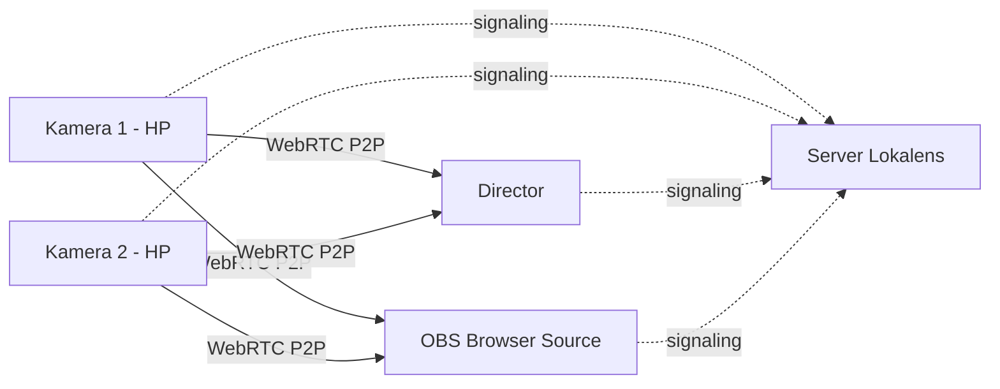

<div align="center">

# 🔴 Lokalens

**Kamera multi-perangkat lewat jaringan lokal untuk OBS dan live streaming.**
**Tanpa internet. Tanpa membebani bandwidth siaran.**


[English](README.md) · **Bahasa Indonesia**

</div>

---

## Apa itu Lokalens?

Lokalens mengubah HP, laptop, dan webcam yang berada di satu jaringan lokal menjadi sumber kamera untuk **OBS Studio**. Buka satu halaman web di HP, tekan **START STREAM**, dan gambarnya langsung muncul di Director dan OBS. Semuanya lewat Wi-Fi/LAN yang sama.

Konsepnya terinspirasi dari [VDO.Ninja](https://vdo.ninja), tetapi **seluruhnya berjalan di jaringan lokal**: halaman web, signaling, dan QR code dilayani oleh server kecil di PC Anda, sedangkan video dan audio mengalir langsung antar-perangkat lewat WebRTC P2P. Tidak ada CDN, tidak ada layanan cloud.

> [!NOTE]
> Ini adalah **V1**. Fokusnya sederhana: kamera masuk ke OBS lewat LAN dengan stabil. Fitur yang belum ada tercatat di bagian [Batasan V1](#batasan-v1).

## Kenapa Lokalens?

Di sebuah acara, internet venue biasanya terbatas dan sudah dipakai untuk mengirim siaran utama ke YouTube, Facebook, atau platform lain. Kalau feed kamera tambahan ikut melewati internet, ia berebut jalur dengan siaran itu.

Lokalens memisahkan keduanya:

```text
Feed kamera    HP ──► Wi-Fi / LAN lokal ──► OBS                  (tidak menyentuh internet)
Siaran utama   OBS ──► Internet ──► YouTube / Facebook / dll.    (bandwidth tetap utuh)
```

- **Bandwidth internet tetap untuk siaran.** Video kamera hanya berjalan di dalam LAN.
- **Tidak ikut terganggu** kalau internet venue lambat atau putus, karena setelah instalasi Lokalens tidak butuh internet sama sekali.
- **Server tidak menjadi relay video.** Server hanya mengurus signaling, sehingga PC server tetap ringan.

**Kekurangannya:** jangkauan terbatas. Semua perangkat harus berada di jaringan yang sama, jadi Lokalens tidak bisa menerima tamu remote dari luar venue seperti solusi berbasis internet.

### Lokalens vs solusi berbasis internet (mis. VDO.Ninja)

| | **Lokalens** | **VDO.Ninja** (penggunaan default) |
|---|---|---|
| Jangkauan | Satu LAN / Wi-Fi / hotspot | Internet, tamu bisa dari mana saja |
| Butuh internet saat dipakai | Tidak | Ya (halaman web, signaling, STUN/TURN online) |
| Beban ke internet venue | Nol | Tergantung rute koneksi |
| Kelengkapan fitur | Ringkas (V1) | Sangat lengkap |
| Setup | Jalankan server di PC sendiri | Buka layanan web yang sudah tersedia |

**Cocok untuk:** acara sekolah dan kampus, wisuda, seminar, ibadah, konser kecil, studio multi-kamera dengan HP sebagai kamera, selama semua kamera berada di venue yang sama.
**Kurang cocok untuk:** kontributor remote di kota atau negara lain.

## Fitur V1

### 📱 Camera (sender)
- Izin kamera dan mikrofon, pilih perangkat, preview
- Resolusi **Auto / 360p / 480p / 720p / 1080p**
- **24 / 30 / 60 FPS**
- Bitrate **Auto / 1 / 2 / 4 / 6 / 8 Mbps**
- Mute mikrofon, ganti kamera depan/belakang (jika perangkat mendukung)
- Statistik langsung: resolusi, FPS, bitrate, RTT
- Reconnect signaling otomatis
- Device key permanen (disimpan di browser), jadi identitas kamera sama di setiap sesi

### 🎛️ Director (viewer)
- Buat atau masuk room, dengan QR code untuk join kamera
- Daftar semua kamera dan preview multi-kamera
- Selected camera, fullscreen, mute audio lokal
- Reconnect, rename, hide/show, dan disconnect kamera
- Tombol **COPY OBS URL** per kamera
- Daftar perangkat dan status koneksi

### 🎬 OBS
- Halaman `/obs/...` minimalis: hanya video di atas latar hitam
- Dilayani lewat **HTTP biasa di port terpisah**, supaya tidak bermasalah dengan sertifikat self-signed di browser OBS

### 📊 Performance Monitor
- `/stats` membaca `RTCPeerConnection.getStats()`: resolusi, FPS, bitrate, packet loss, RTT, jitter, connection state, dan codec (jika browser menyediakannya)

## Cara kerja



- **Media:** WebRTC P2P langsung dari kamera ke viewer. Tidak ada byte video yang lewat server.
- **Server:** Express + Socket.IO, hanya untuk web app, signaling, manajemen room, metadata perangkat, dan QR.
- **Database:** tidak ada. Room disimpan di memori server.
- **QR code:** dibuat lokal oleh package `qrcode`, tanpa layanan QR online.
- **Frontend:** HTML/CSS/JavaScript statis, tanpa build step dan tanpa CDN.

## Kebutuhan

- **Node.js 20+** dan npm (internet hanya dibutuhkan sekali untuk `npm install`)
- **OpenSSL** untuk membuat sertifikat HTTPS lokal
- Semua perangkat berada di **LAN / Wi-Fi / hotspot yang sama**. Router tidak perlu tersambung ke internet.
- Browser modern dengan dukungan WebRTC

## Instalasi

```bash
git clone https://github.com/USERNAME/lokalens.git
cd lokalens
npm install
npm run cert   # buat sertifikat HTTPS lokal (cukup sekali)
npm start
```

Terminal akan menampilkan alamat LAN server, misalnya `https://192.168.1.10:3000`.

**Launcher cepat:** jalankan `start-windows.bat` (Windows) atau `./start-linux.sh` (Linux). Launcher memasang dependency dan membuat sertifikat jika belum ada, lalu menjalankan server.

> [!IMPORTANT]
> Browser mobile umumnya **mewajibkan HTTPS** untuk mengakses kamera/mikrofon pada alamat IP LAN. Sertifikat yang dibuat `npm run cert` bersifat self-signed dan memuat IP LAN yang terdeteksi saat dibuat. Saat pertama membuka server dari HP, terima peringatan sertifikat sekali, lalu izinkan Camera dan Microphone.

> [!TIP]
> **Windows:** `npm run cert` membutuhkan `openssl` di PATH. Cara termudah adalah menjalankan perintah itu dari **Git Bash**, karena Git for Windows biasanya sudah menyertakan OpenSSL. Jika `start-windows.bat` berhenti di langkah sertifikat, jalankan `npm run cert` dari Git Bash lebih dulu.

<details>
<summary><b>Firewall (klik jika perangkat lain tidak bisa membuka server)</b></summary>

Izinkan koneksi masuk ke port **3000** dan **3001** (TCP), atau pilih **Allow** saat Windows menampilkan dialog firewall untuk Node.js pada jaringan Private.

```powershell
# Windows (PowerShell sebagai Administrator)
netsh advfirewall firewall add rule name="Lokalens" dir=in action=allow protocol=TCP localport=3000,3001
```

```bash
# Linux (ufw)
sudo ufw allow 3000/tcp
sudo ufw allow 3001/tcp
```

</details>

## Cara pakai

### 1. Director (PC)
1. Jalankan server di PC.
2. Buka `https://<IP-LAN>:3000/director` dan terima peringatan sertifikat.
   Gunakan **IP LAN**, bukan `localhost`, supaya URL OBS yang dihasilkan juga bisa dipakai dari PC lain.
3. Klik **CREATE ROOM**, isi nama room. Room ID dan QR code akan muncul.

### 2. Kamera (HP / laptop)
1. Scan QR dari Director, atau buka `https://<IP-LAN>:3000/camera` lalu masukkan Room ID.
2. Izinkan kamera dan mikrofon.
3. Atur nama, resolusi, FPS, dan bitrate. Default: **720p, 30 FPS, 4 Mbps**.
4. Tekan **START STREAM**. Director otomatis meminta koneksi WebRTC dari kamera.

### 3. OBS Studio
1. Di Director, tekan **COPY OBS URL** pada kamera yang diinginkan.
2. Di OBS: **Sources → + → Browser**, tempel URL, lalu isi **Width 1920** dan **Height 1080**.
3. Ulangi untuk kamera lain.

Format URL OBS:

```text
http://<IP-LAN>:3001/obs/<camera-key>?room=<ROOM-ID>
```

`<camera-key>` adalah device key kamera. Anda juga bisa memakai **nama kamera** dengan huruf kecil dan spasi diganti `-`, misalnya `CAMERA 01` menjadi `camera-01`. Gunakan nama yang unik antar kamera.

> [!TIP]
> Di pengaturan Browser Source OBS, biarkan **Shutdown source when not visible** dan **Refresh browser when scene becomes active** tidak dicentang, supaya koneksi tetap hidup saat berpindah scene.

### 4. Statistik (opsional)
Buka `https://<IP-LAN>:3000/stats` di browser yang sama setelah masuk room lewat Director, atau tambahkan `?room=<ROOM-ID>`. **Tutup halaman ini saat live** (lihat [tips](#tips-agar-stabil-di-acara)).

## Halaman dan port

| Halaman | URL | Protokol | Fungsi |
|---|---|---|---|
| Beranda | `https://<IP>:3000/` | HTTPS | Landing dan daftar alamat LAN |
| Director | `https://<IP>:3000/director` | HTTPS | Kontrol room dan preview semua kamera |
| Camera | `https://<IP>:3000/camera` | HTTPS | Mengirim kamera/mic dari perangkat |
| Stats | `https://<IP>:3000/stats` | HTTPS | Monitor performa WebRTC |
| OBS | `http://<IP>:3001/obs/<key>?room=<ID>` | **HTTP** | Browser Source untuk OBS |

## Konfigurasi

| Variabel | Default | Keterangan |
|---|---|---|
| `HOST` | `0.0.0.0` | Alamat bind server |
| `PORT` | `3000` | Port utama (HTTPS) |
| `OBS_PORT` | `3001` | Port HTTP khusus halaman OBS |
| `APP_NAME` | `LOCAL VIDEO NETWORK` | Nama aplikasi yang dikembalikan oleh `/api/config` |
| `ICE_SERVERS_JSON` | `[]` | Daftar ICE server (STUN/TURN) dalam format JSON |

Set variabel lewat shell:

```bash
# Linux / macOS
PORT=8443 OBS_PORT=8080 npm start
```

```powershell
# Windows PowerShell
$env:PORT=8443; $env:OBS_PORT=8080; npm start
```

> [!NOTE]
> `.env.example` hanya contoh. Aplikasi **tidak memuat file `.env` secara otomatis**. Untuk memakainya, jalankan `node --env-file=.env server.js` (Node.js 20.6+).

**ICE / STUN / TURN:** biarkan `[]` untuk penggunaan LAN murni. Server STUN/TURN cloud tidak diperlukan selama perangkat bisa saling menemukan lewat host candidate di jaringan yang sama. Contoh jika Anda menjalankan STUN lokal:

```powershell
$env:ICE_SERVERS_JSON='[{"urls":"stun:192.168.1.10:3478"}]'
npm start
```

## Tips agar stabil di acara

1. **Pakai jaringan khusus produksi.** Router atau hotspot sendiri, jangan digabung dengan Wi-Fi tamu atau penonton. Router tidak perlu tersambung ke internet.
2. **PC pakai kabel LAN, HP pakai Wi-Fi 5 GHz** dan usahakan dekat dengan access point.
3. **Hitung upload HP.** Setiap viewer (Director, OBS, halaman Stats) membuka satu koneksi P2P terpisah ke kamera, sehingga upload HP kira-kira `bitrate × jumlah viewer`. Contoh: 4 Mbps × 2 (Director + OBS) = hingga 8 Mbps dari satu HP. Turunkan resolusi atau bitrate jika Wi-Fi padat.
4. **Tutup `/stats` saat live.** Halaman itu membuka koneksi tambahan ke setiap kamera.
5. **Buat room sebelum acara dan jangan restart server.** Room disimpan di memori. Jika room dibuat ulang, Room ID berubah dan URL OBS harus disalin ulang.
6. **Beri PC server IP tetap** (atau DHCP reservation) agar sertifikat dan URL tidak berubah.
7. **Siapkan HP:** colok charger, matikan auto-lock layar, dan biarkan tab kamera tetap di depan.
8. **Uji sebelum acara**, termasuk dengan internet dicabut, untuk memastikan semuanya benar-benar lokal.

## Troubleshooting

| Gejala | Penyebab dan solusi |
|---|---|
| HP tidak bisa mengakses kamera/mikrofon | Buka lewat `https://` (bukan `http://`), terima sertifikat sekali, lalu izinkan Camera dan Microphone di browser. |
| Peringatan sertifikat muncul | Normal, karena sertifikatnya self-signed. Lanjutkan/proceed di browser. |
| Kamera tidak muncul di Director | Pastikan satu jaringan dan Room ID sama. Matikan **AP/Client Isolation** di router (sering aktif di Wi-Fi tamu). Periksa firewall. |
| OBS menampilkan `WEBRTC FAILED` atau `ICE FAILED` | Biasanya firewall, client isolation, VPN aktif, atau perangkat berada di subnet berbeda. |
| OBS menampilkan `Password room salah.` | Halaman OBS di V1 belum mendukung room ber-password. Buat room **tanpa password**. |
| OBS menampilkan `Room tidak ditemukan.` | Room sudah hilang (server restart atau semua perangkat keluar) atau Room ID di URL salah. Buat room baru lalu salin ulang URL OBS. |
| OBS menampilkan `Camera tidak ditemukan.` | Kamera belum menekan START STREAM, atau key/nama di URL tidak cocok. |
| OBS tidak ada suara | Di V1 audio pada halaman OBS di-mute. Lihat [Batasan V1](#batasan-v1). |
| QR mengarah ke IP yang salah | PC punya beberapa network adapter (VPN, VirtualBox, Docker, dll.) dan QR memakai IP LAN pertama yang terdeteksi. Nonaktifkan adapter lain atau ketik URL secara manual. |
| Sertifikat tidak cocok setelah IP PC berubah | Hapus `cert/*.pem`, lalu jalankan `npm run cert` lagi. |
| `EADDRINUSE` saat start | Port sudah dipakai program lain. Ubah `PORT` / `OBS_PORT`. |
| Video patah-patah | Turunkan resolusi/bitrate, pindah ke Wi-Fi 5 GHz, kurangi jumlah viewer, dekatkan HP ke access point. |
| Kamera berhenti saat layar HP mati | Matikan auto-lock dan mode hemat daya, biarkan tab tetap di depan. |

## Batasan V1

- **Hanya LAN.** Perangkat di luar jaringan yang sama tidak bisa terhubung.
- **Mesh P2P.** Upload kamera bertambah seiring jumlah viewer. Pengaturan bitrate berlaku sama untuk semua viewer.
- **Audio di halaman OBS di-mute.** Video masuk ke OBS, audionya belum. Sementara ini gunakan sumber audio terpisah di OBS.
- **Room ber-password tidak bisa dipakai OBS dan Stats.** Halaman OBS dan Stats belum mengirim password saat join.
- **Room hanya di memori.** Room hilang saat server restart atau saat semua perangkat keluar.
- **Layar HP bisa tidur.** V1 belum memakai Screen Wake Lock.
- **Belum ada** rekaman, output NDI/SRT/RTMP, atau pemilihan hardware encoder.
- **Sertifikat self-signed** selalu menampilkan peringatan browser di kunjungan pertama.
- **Perilaku browser mobile berbeda-beda** untuk label perangkat, 60 FPS, 1080p, dan pergantian kamera.

## Ide pengembangan

- Audio ke OBS (dengan opsi unmute)
- SFU lokal, agar satu kamera cukup mengunggah satu stream walau viewer banyak
- Dukungan password di halaman OBS dan Stats
- Screen Wake Lock di halaman kamera
- Bitrate terpisah per viewer (mis. preview Director lebih rendah dari output OBS)
- Rekaman dan output NDI/SRT/RTMP

## Keamanan

Lokalens dirancang untuk **jaringan lokal yang tepercaya**.

- Jangan meneruskan port `3000`/`3001` ke internet (port forwarding).
- Password room hanyalah gerbang sederhana. Password disimpan sebagai teks biasa di memori server dan ikut tertanam di URL QR.
- Metadata room dan QR dapat dibaca oleh perangkat mana pun di LAN yang mengetahui Room ID.
- Tidak ada akun pengguna atau autentikasi lain di V1.

## Struktur proyek

```text
lokalens/
├─ server.js               # Express + Socket.IO (HTTPS utama + HTTP untuk OBS)
├─ package.json
├─ .env.example
├─ start-windows.bat       # launcher Windows
├─ start-linux.sh          # launcher Linux
├─ lib/
│  ├─ config.js            # konfigurasi, deteksi IP LAN, ICE servers
│  └─ rooms.js             # manajemen room di memori
├─ scripts/
│  └─ generate-cert.js     # pembuat sertifikat HTTPS lokal
├─ cert/                   # cert.pem dan key.pem (tidak di-commit)
└─ public/
   ├─ index.html
   ├─ camera.html / camera.js
   ├─ director.html / director.js
   ├─ obs.html / obs.js
   ├─ stats.html / stats.js
   ├─ app.js               # helper bersama
   └─ styles.css
```

<details>
<summary><b>Referensi teknis: REST API dan event signaling</b></summary>

### REST API

| Method | Endpoint | Fungsi |
|---|---|---|
| `GET` | `/api/config` | Konfigurasi publik: port, IP LAN, ICE servers, status HTTPS |
| `POST` | `/api/rooms` | Buat room. Body: `{ "name": "...", "password": "..." }` |
| `GET` | `/api/rooms/:roomId` | Info room dan daftar perangkat |
| `GET` | `/api/rooms/:roomId/qr` | QR code (data URL) dan join URL untuk kamera |

### Event Socket.IO

**Client → server:** `create-room`, `join-room`, `set-status`, `rename-device`, `rename-peer`, `disconnect-device`, `signal`, `request-camera`, `request-camera-key`

**Server → client:** `room-created`, `joined-room`, `room-state`, `signal`, `viewer-request`, `remote-rename`, `force-disconnect`, `error-message`

Peran perangkat dalam room: `director`, `camera`, `viewer`. Pesan `signal` hanya membawa SDP dan ICE candidate, tidak pernah media.

</details>

## Kontribusi

Issue dan pull request dipersilakan. Karena perilaku WebRTC sangat bergantung pada perangkat dan jaringan, mohon sertakan model perangkat, browser, dan kondisi jaringan saat melaporkan bug.

## Lisensi

Proyek ini dilisensikan di bawah [Lisensi MIT](LICENSE).

## Disclaimer

Lokalens adalah proyek independen. Proyek ini tidak berafiliasi dengan, disponsori, atau didukung oleh VDO.Ninja maupun pembuatnya. VDO.Ninja, OBS Studio, dan nama produk lain adalah milik pemilik masing-masing dan disebut hanya untuk menjelaskan inspirasi dan kompatibilitas.
