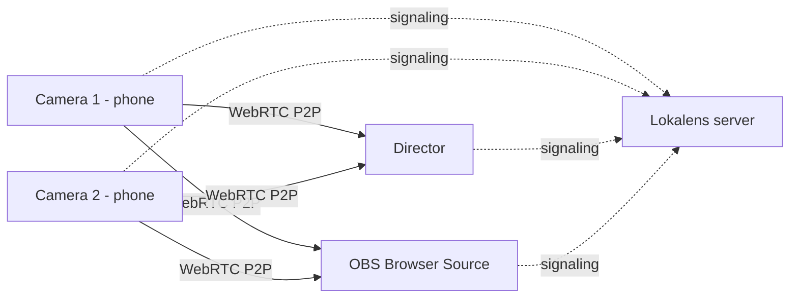

<div align="center">

# 🔴 Lokalens

**Multi-device cameras over your local network for OBS and live streaming.**
**No internet required. No load on your stream's bandwidth.**


**English** · [Bahasa Indonesia](README.id.md)

</div>

---

## What is Lokalens?

Lokalens turns phones, laptops, and webcams on the same local network into camera sources for **OBS Studio**. Open a web page on your phone, tap **START STREAM**, and the picture shows up in the Director and in OBS. All of it runs over the same Wi-Fi/LAN.

The concept is inspired by [VDO.Ninja](https://vdo.ninja), but **everything runs on your local network**: the web app, signaling, and QR codes are served by a small server on your own PC, while video and audio flow directly between devices over WebRTC P2P. No CDN, no cloud services.

> [!NOTE]
> This is **V1**. The goal is simple: get cameras into OBS over the LAN reliably. Features that are not there yet are listed in [V1 Limitations](#v1-limitations).

## Why Lokalens?

At an event, the venue's internet is usually limited and already busy carrying your main broadcast to YouTube, Facebook, or another platform. If extra camera feeds also travel over the internet, they compete with that broadcast for the same bandwidth.

Lokalens keeps the two separate:

```text
Camera feeds    Phone ──► local Wi-Fi / LAN ──► OBS                (never touches the internet)
Main broadcast  OBS ──► Internet ──► YouTube / Facebook / etc.     (bandwidth stays free)
```

- **Internet bandwidth stays reserved for your broadcast.** Camera video only travels inside the LAN.
- **Unaffected if the venue's internet is slow or drops**, because after installation Lokalens needs no internet at all.
- **The server never relays video.** It only handles signaling, so the server PC stays light.

**The trade-off:** limited reach. All devices must be on the same network, so Lokalens cannot take remote guests from outside the venue the way internet-based tools can.

### Lokalens vs internet-based tools (e.g. VDO.Ninja)

| | **Lokalens** | **VDO.Ninja** (default usage) |
|---|---|---|
| Reach | One LAN / Wi-Fi / hotspot | Internet; guests can join from anywhere |
| Internet needed while running | No | Yes (hosted web page, signaling, online STUN/TURN) |
| Load on venue internet | None | Depends on connection routing |
| Feature depth | Minimal (V1) | Very extensive |
| Setup | Run a server on your own PC | Open an already-hosted web service |

**Great for:** school and campus events, graduations, seminars, worship services, small concerts, and multi-camera studios that use phones as cameras, as long as every camera is at the same venue.
**Not a fit for:** remote contributors in another city or country.

## V1 Features

### 📱 Camera (sender)
- Camera and microphone permission, device selection, live preview
- Resolution: **Auto / 360p / 480p / 720p / 1080p**
- **24 / 30 / 60 FPS**
- Bitrate: **Auto / 1 / 2 / 4 / 6 / 8 Mbps**
- Mic mute, front/back camera switch (where the device supports it)
- Live stats: resolution, FPS, bitrate, RTT
- Automatic signaling reconnect
- Persistent device key (stored in the browser), so a camera keeps the same identity across sessions

### 🎛️ Director (viewer)
- Create or join a room, with a QR code for cameras to join
- List of all cameras and multi-camera preview
- Selected camera, fullscreen, local audio mute
- Reconnect, rename, hide/show, and disconnect cameras
- **COPY OBS URL** button for each camera
- Device list with connection status

### 🎬 OBS
- A minimal `/obs/...` page: just video on a black background
- Served over **plain HTTP on a separate port**, so the browser inside OBS has no trouble with the self-signed certificate

### 📊 Performance Monitor
- `/stats` reads `RTCPeerConnection.getStats()`: resolution, FPS, bitrate, packet loss, RTT, jitter, connection state, and codec (when the browser provides it)

## How it works



- **Media:** WebRTC P2P straight from camera to viewer. No video bytes pass through the server.
- **Server:** Express + Socket.IO, used only for the web app, signaling, room management, device metadata, and QR codes.
- **Database:** none. Rooms are kept in server memory.
- **QR codes:** generated locally by the `qrcode` package, with no online QR service.
- **Frontend:** static HTML/CSS/JavaScript, no build step and no CDN.

## Requirements

- **Node.js 20+** and npm (internet is only needed once, for `npm install`)
- **OpenSSL**, to generate the local HTTPS certificate
- All devices on the **same LAN / Wi-Fi / hotspot**. The router does not need to be connected to the internet.
- A modern browser with WebRTC support

## Installation

```bash
git clone https://github.com/USERNAME/lokalens.git
cd lokalens
npm install
npm run cert   # generate the local HTTPS certificate (once)
npm start
```

The terminal prints the server's LAN address, for example `https://192.168.1.10:3000`.

**Quick launchers:** run `start-windows.bat` (Windows) or `./start-linux.sh` (Linux). They install dependencies and create the certificate if missing, then start the server.

> [!IMPORTANT]
> Mobile browsers generally **require HTTPS** to access the camera/microphone on a LAN IP address. The certificate created by `npm run cert` is self-signed and includes the LAN IPs detected at creation time. The first time you open the server from a phone, accept the certificate warning once, then allow Camera and Microphone.

> [!TIP]
> **Windows:** `npm run cert` needs `openssl` on your PATH. The easiest way is to run that command from **Git Bash**, since Git for Windows usually ships with OpenSSL. If `start-windows.bat` stops at the certificate step, run `npm run cert` from Git Bash first.

<details>
<summary><b>Firewall (click if other devices can't open the server)</b></summary>

Allow inbound connections on ports **3000** and **3001** (TCP), or choose **Allow** when Windows shows the firewall prompt for Node.js on Private networks.

```powershell
# Windows (PowerShell as Administrator)
netsh advfirewall firewall add rule name="Lokalens" dir=in action=allow protocol=TCP localport=3000,3001
```

```bash
# Linux (ufw)
sudo ufw allow 3000/tcp
sudo ufw allow 3001/tcp
```

</details>

## Usage

### 1. Director (PC)
1. Start the server on the PC.
2. Open `https://<LAN-IP>:3000/director` and accept the certificate warning.
   Use the **LAN IP**, not `localhost`, so the OBS URLs it generates also work from other PCs.
3. Click **CREATE ROOM** and enter a room name. The Room ID and QR code appear.

### 2. Camera (phone / laptop)
1. Scan the QR code from the Director, or open `https://<LAN-IP>:3000/camera` and enter the Room ID.
2. Allow camera and microphone access.
3. Set the name, resolution, FPS, and bitrate. Defaults: **720p, 30 FPS, 4 Mbps**.
4. Tap **START STREAM**. The Director automatically requests a WebRTC connection from the camera.

### 3. OBS Studio
1. In the Director, click **COPY OBS URL** on the camera you want.
2. In OBS: **Sources → + → Browser**, paste the URL, and set **Width 1920** and **Height 1080**.
3. Repeat for other cameras.

OBS URL format:

```text
http://<LAN-IP>:3001/obs/<camera-key>?room=<ROOM-ID>
```

`<camera-key>` is the camera's device key. You can also use the **camera name** in lowercase with spaces replaced by `-`, e.g. `CAMERA 01` becomes `camera-01`. Keep camera names unique.

> [!TIP]
> In the OBS Browser Source settings, leave **Shutdown source when not visible** and **Refresh browser when scene becomes active** unchecked so the connection stays alive when you switch scenes.

### 4. Stats (optional)
Open `https://<LAN-IP>:3000/stats` in the same browser after joining a room through the Director, or add `?room=<ROOM-ID>`. **Close this page while live** (see [tips](#tips-for-a-stable-event)).

## Pages and ports

| Page | URL | Protocol | Purpose |
|---|---|---|---|
| Home | `https://<IP>:3000/` | HTTPS | Landing page and LAN addresses |
| Director | `https://<IP>:3000/director` | HTTPS | Room control and preview of all cameras |
| Camera | `https://<IP>:3000/camera` | HTTPS | Sends camera/mic from a device |
| Stats | `https://<IP>:3000/stats` | HTTPS | WebRTC performance monitor |
| OBS | `http://<IP>:3001/obs/<key>?room=<ID>` | **HTTP** | Browser Source for OBS |

## Configuration

| Variable | Default | Description |
|---|---|---|
| `HOST` | `0.0.0.0` | Address the server binds to |
| `PORT` | `3000` | Main port (HTTPS) |
| `OBS_PORT` | `3001` | HTTP port dedicated to the OBS page |
| `APP_NAME` | `LOCAL VIDEO NETWORK` | App name returned by `/api/config` |
| `ICE_SERVERS_JSON` | `[]` | ICE server list (STUN/TURN) as JSON |

Set variables through your shell:

```bash
# Linux / macOS
PORT=8443 OBS_PORT=8080 npm start
```

```powershell
# Windows PowerShell
$env:PORT=8443; $env:OBS_PORT=8080; npm start
```

> [!NOTE]
> `.env.example` is only a sample. The app **does not load a `.env` file automatically**. To use one, run `node --env-file=.env server.js` (Node.js 20.6+).

**ICE / STUN / TURN:** leave it as `[]` for pure LAN use. Cloud STUN/TURN servers are not needed as long as devices can find each other through host candidates on the same network. Example if you run a local STUN server:

```powershell
$env:ICE_SERVERS_JSON='[{"urls":"stun:192.168.1.10:3478"}]'
npm start
```

## Tips for a stable event

1. **Use a dedicated production network.** Your own router or hotspot, not shared with guest or audience Wi-Fi. The router does not need internet.
2. **Wired LAN for the PC, 5 GHz Wi-Fi for phones**, and keep phones close to the access point.
3. **Do the upload math.** Every viewer (Director, OBS, the Stats page) opens its own separate P2P connection to the camera, so a phone's upload is roughly `bitrate × number of viewers`. Example: 4 Mbps × 2 (Director + OBS) = up to 8 Mbps from a single phone. Lower the resolution or bitrate if Wi-Fi is crowded.
4. **Close `/stats` while live.** That page opens an extra connection to every camera.
5. **Create the room before the event and don't restart the server.** Rooms live in memory. If a room is recreated, the Room ID changes and OBS URLs must be copied again.
6. **Give the server PC a fixed IP** (or a DHCP reservation) so the certificate and URLs don't change.
7. **Prepare the phones:** plug in chargers, disable screen auto-lock, and keep the camera tab in the foreground.
8. **Test before the event**, including with the internet unplugged, to confirm everything is truly local.

## Troubleshooting

Messages shown by the app are in Indonesian in V1; the English meaning is given in parentheses.

| Symptom | Cause and fix |
|---|---|
| Phone can't access camera/microphone | Open the page over `https://` (not `http://`), accept the certificate once, then allow Camera and Microphone in the browser. |
| Certificate warning appears | Expected, because the certificate is self-signed. Proceed in the browser. |
| Camera doesn't appear in the Director | Make sure both are on the same network with the same Room ID. Turn off **AP/Client Isolation** on the router (often enabled on guest Wi-Fi). Check the firewall. |
| OBS shows `WEBRTC FAILED` or `ICE FAILED` | Usually a firewall, client isolation, an active VPN, or devices on different subnets. |
| OBS shows `Password room salah.` (wrong room password) | The V1 OBS page doesn't support password-protected rooms. Create the room **without a password**. |
| OBS shows `Room tidak ditemukan.` (room not found) | The room is gone (server restarted or all devices left), or the Room ID in the URL is wrong. Create a new room and copy the OBS URL again. |
| OBS shows `Camera tidak ditemukan.` (camera not found) | The camera hasn't pressed START STREAM, or the key/name in the URL doesn't match. |
| No sound in OBS | In V1 the OBS page's audio is muted. See [V1 Limitations](#v1-limitations). |
| QR code points to the wrong IP | The PC has several network adapters (VPN, VirtualBox, Docker, etc.) and the QR uses the first LAN IP found. Disable the other adapters or type the URL manually. |
| Certificate mismatch after the PC's IP changed | Delete `cert/*.pem`, then run `npm run cert` again. |
| `EADDRINUSE` on start | Another program is using the port. Change `PORT` / `OBS_PORT`. |
| Choppy video | Lower resolution/bitrate, move to 5 GHz Wi-Fi, reduce the number of viewers, move the phone closer to the access point. |
| Camera stops when the phone screen turns off | Disable auto-lock and battery saver, and keep the tab in the foreground. |

## V1 Limitations

- **LAN only.** Devices outside the same network cannot connect.
- **P2P mesh.** A camera's upload grows with the number of viewers. The bitrate setting applies equally to every viewer.
- **Audio on the OBS page is muted.** Video reaches OBS, audio does not yet. For now, use a separate audio source in OBS.
- **Password-protected rooms don't work with OBS and Stats.** Those pages don't send the password when joining.
- **Rooms live in memory only.** A room disappears when the server restarts or when all devices leave.
- **Phone screens can sleep.** V1 doesn't use the Screen Wake Lock API.
- **Some UI messages are in Indonesian.** Toasts, status text, and error messages have not been localized yet.
- **Not included yet:** recording, NDI/SRT/RTMP output, and hardware encoder selection.
- **Self-signed certificate** always shows a browser warning on the first visit.
- **Mobile browsers behave differently** for device labels, 60 FPS, 1080p, and camera switching.

## Ideas for future versions

- Audio to OBS (with an unmute option)
- Local SFU, so a camera uploads a single stream even with many viewers
- Password support on the OBS and Stats pages
- Screen Wake Lock on the camera page
- Per-viewer bitrate (e.g. lower for the Director preview than for the OBS output)
- Recording and NDI/SRT/RTMP output
- UI localization (English / Indonesian)

## Security

Lokalens is designed for a **trusted local network**.

- Do not forward ports `3000`/`3001` to the internet.
- The room password is only a simple gate. It is stored as plain text in server memory and is embedded in the QR URL.
- Room metadata and the QR code can be read by any device on the LAN that knows the Room ID.
- There are no user accounts or other authentication in V1.

## Project structure

```text
lokalens/
├─ server.js               # Express + Socket.IO (main HTTPS + HTTP for OBS)
├─ package.json
├─ .env.example
├─ start-windows.bat       # Windows launcher
├─ start-linux.sh          # Linux launcher
├─ lib/
│  ├─ config.js            # config, LAN IP detection, ICE servers
│  └─ rooms.js             # in-memory room management
├─ scripts/
│  └─ generate-cert.js     # local HTTPS certificate generator
├─ cert/                   # cert.pem and key.pem (not committed)
└─ public/
   ├─ index.html
   ├─ camera.html / camera.js
   ├─ director.html / director.js
   ├─ obs.html / obs.js
   ├─ stats.html / stats.js
   ├─ app.js               # shared helpers
   └─ styles.css
```

<details>
<summary><b>Technical reference: REST API and signaling events</b></summary>

### REST API

| Method | Endpoint | Purpose |
|---|---|---|
| `GET` | `/api/config` | Public config: ports, LAN IPs, ICE servers, HTTPS status |
| `POST` | `/api/rooms` | Create a room. Body: `{ "name": "...", "password": "..." }` |
| `GET` | `/api/rooms/:roomId` | Room info and device list |
| `GET` | `/api/rooms/:roomId/qr` | QR code (data URL) and the camera join URL |

### Socket.IO events

**Client → server:** `create-room`, `join-room`, `set-status`, `rename-device`, `rename-peer`, `disconnect-device`, `signal`, `request-camera`, `request-camera-key`

**Server → client:** `room-created`, `joined-room`, `room-state`, `signal`, `viewer-request`, `remote-rename`, `force-disconnect`, `error-message`

Device roles in a room: `director`, `camera`, `viewer`. `signal` messages carry only SDP and ICE candidates, never media.

</details>

## Contributing

Issues and pull requests are welcome. Because WebRTC behavior depends heavily on devices and networks, please include the device model, browser, and network conditions when reporting a bug.

## License

This project is licensed under the [MIT License](LICENSE).

## Disclaimer

Lokalens is an independent project. It is not affiliated with, sponsored by, or endorsed by VDO.Ninja or its author. VDO.Ninja, OBS Studio, and other product names belong to their respective owners and are mentioned only to describe inspiration and compatibility.
